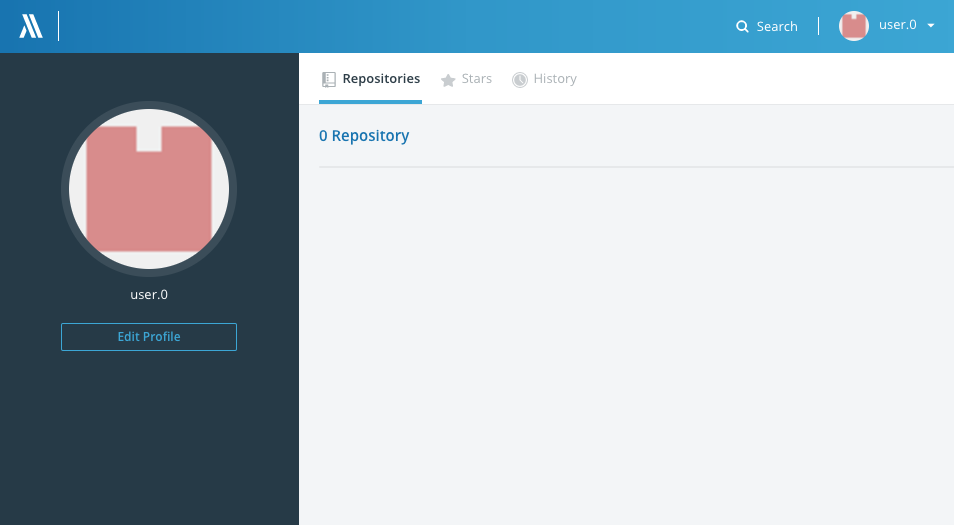
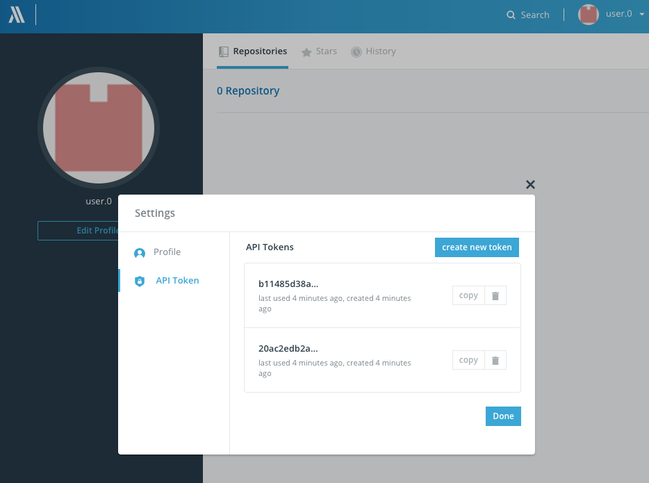

## Manage API Token on Insight.io

Beside the APIs to manage the **API Access Token** itself, we also provide
UIs to do so as well. Follow the following steps to find it on Insight.io

1. Log into Insight.io and go to `/account/projects` page.

2. Click the **Edit Profile** button on the lefthand side under your user
avatar.

	

3. Select the **API Token** Tab on the popped out modal

	

4. Now you should be able to see the UI to manage your personal API tokens.
	
	* Hit **Create new token** button on the top right corner to create a
	new token.
	* Click the **Copy** button on each token item to copy the full token
	into your clipboard.
	* Click the garbage can icon on each token item to delele that
	particular token.