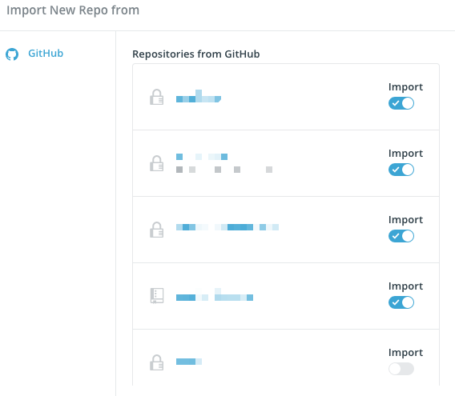
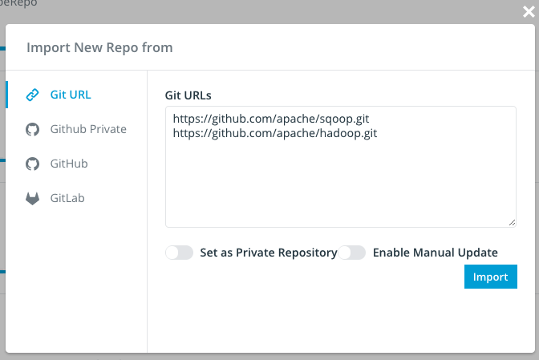

# Add Repositories

There are two ways you can add repositories to Insight.io: through integration or through Git address.

## Import through integration
If you setup with integration with other SCMs(GitHub, GitLab etc.), you can go to `Import New Repo` button on the top right and you should see a list of repos you have access to from your SCM providers. If need to grant insight.io private repo access if you want to import private repositories.

```
http://$HostName/account/projects
```



Click on `import` switch to start the import process.

## Import through Git Address

If you are not using any integration, you can also import repository through vanilla Git address. Note that you need admin access to import Git address directly.

You can go to

```
http://$HostName/admin/projects
```

Put Git clone address into `Git URLs` text box and press `Import`. 


