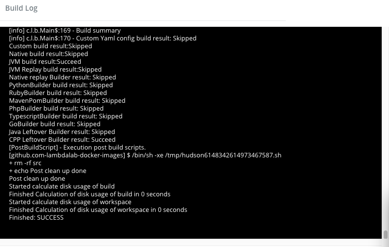

# Obtain Code Analysis Log

Internally Insight.io uses Jenkins to build your project and relies on the build process to perform code analysis. You can access code analysis logs through project list:

```$HostName/account/projects```

Click on the information button of each project item will bring out the latest analysis log:


