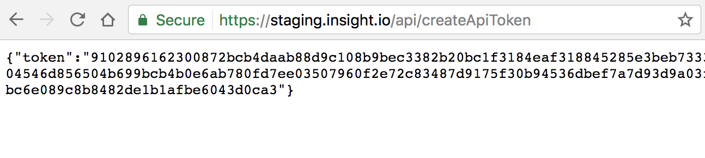

# Use Api Access Token

Api access token acts like ordinary OAuth token, so that you don't need to bear the password and username with you  all the time. You can understand it as a counterpart of `Personal Access Tokens <https://github.com/settings/tokens>`_ of Github. On Insight.io, api access token is not only enabled for username/password authentication, but also for all other supported third party OAuth services enabled. This documentation shows you have to leverage api access token to interact with Insight.io with more flexibility.

An user could create as many api access token as he/she wants, but be extremely aware that whenever an token is created, it works forever until you delete/revoke it explicitly. So we highly recommend to always actively manage your api access token whenever necessary.

## Token Creation

There are 2 ways to create an api access token, choose the one fits your use case best. In the meantime, we are building an UI to
manage api access tokens on top of these APIs.


### Creation after Authentication

If you have already logged into Insight.io already, we can recognize you from your cookie. `GET` `api/createApiToken` will
generate a new token and return it to you.

```
GET /api/createApiToken
```

**Usage**

Access `$Hostname/api/createApiToken` in your browser and you should be able to generate a new api token.



You can copy this token for later usage. If you want to find all previous created tokens, please refer to **List All Tokens** section below.

## Token Usage


Whenever your have a token, you can talk to Insight.io via REST api without explicit authentication process. Attach the
token in `X-Auth-Token` HTTP header and you should be able to pass the authentication and get your desired response.

**Usage**

```bash
curl -v --header "X-Auth-Token:<your api access token>" <host>/api/getUserRecentFiles
```

**Response**

If you provide the correct token, you should get the desired response:

```json
HTTP/1.1 200 OK
[
  {
    "id":"github.com/aws/aws-sdk-java",
    "name":"aws-sdk-java",
    "timeStamp":1496358397966,
    "revision":"1.11.105",
    "path":"aws-java-sdk-cloudhsm/src/test/java/com/amazonaws/services/cloudhsm/smoketests/RunCucumberTest.java"
  },
  {
    "id":"github.com/aws/aws-sdk-java",
    "name":"aws-sdk-java",
    "timeStamp":1496358392087,
    "revision":"1.11.105",
    "path":"aws-java-sdk-core/src/main/java/com/amazonaws/AmazonWebServiceRequest.java"
  }
]
```

Otherwise, you will get error.

```json
HTTP/1.1 401 Unauthorized
{
  "error":"Credentials required"
}
```

## Token Deletion

To delete or revoke an api access token, `GET` `/api/revokeApiToken` with the target token attached in the `X-Auth-Token`.

```
GET /api/revokeApiToken
```

**Usage**

```bash
curl -v --header "X-Auth-Token:<your api access token>" <host>/api/revokeApiToken
```

**Response**

You will always get an `HTTP/1.1 200 OK` no matter whether your token is valid or not.


## List All Tokens


To view all existing api access token in your account, `GET` `/api/getApiTokens` with any valid access token attached in the `X-Auth-Token`, just like calling any other REST api, which requires authentication.

In the response, `created` is the timestamp when the token was first created. `lastUsed` is the timestamp when the token was used
most recently.

**Usage**
```bash
curl -v --header "X-Auth-Token:<your api token>" <host>/api/getApiTokens
```

**Response**

```json
HTTP/1.1 200 OK
[
  {
    "uid":"ldap@user.0",
    "apiToken":"95e1110da97bf616d2e6838677f0275d73c5bd9e7b746c067599f9b7def02673f09b865929255291d221943f59e2f8060624480fc3d9322ed753604a89dc501060cfd01327fa65ecf65b6c540c236a836afb1e5f3234b84d9a0c23703752bb9ba53133431e300a5ad647767d25194172c824bb2308861562f6cb704f89f5f89f",
    "created":1496357580959,
    "lastUsed":1496357580959
  },
  {
    "uid":"ldap@user.0",
    "apiToken":"c9d1a9dd3ec6fa0f41543071f1c98cc6b66a7350e0ec481e45b4ac25ce962f646adfe474854ccb7b574c2ea2976670c4973c9f7b71bfedc21d4e69d4896640cac0e3a54f26fd508aadba093d192ebbb03f1e977ef03698bccb036128e8cb13b443db1709da637bbcbec72c7e8f19e697f10610f5f744902c5678f5f6cf9e218c",
    "created":1496358254649,
    "lastUsed":1496358254649
  }
]
```
