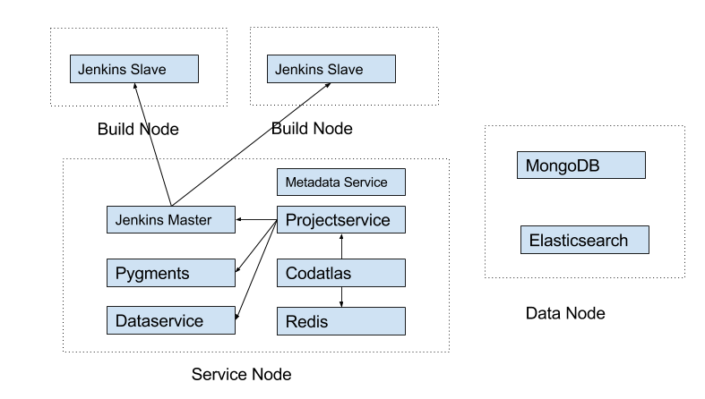

# Deploy Insight.io with Multiple Machines

If your repositories take a lot of resources to build, it could be helpful or necessary to isolate build related services from frontend services from underlying database and search index. Fortunately Insight.io's micro-service architecture and dockerized deployment makes this easy. 

The recommended way to seperate the services will be group them into 3 groups, namely:

1. Frontend services: codatlas, redis, liaceservice, dataservice, projectservice, metadataservice, ngnix, jenkins(master)

2. Db services: db, elasticsearch

3. Build services (could have more than one machines): jenkins-slave




To start, make sure you have 3 machines ready with docker and docker-compose installed, and lambdalab-docker repository checked out.

On all three machines, use

```bash
./lambda-compose-dis
```

or

```
./cn-lambda-compose-dis
```

instead of `./lambda-compose` or `./lambda-compose-cn`

and add the hostname of each machine by edit the following file:

```bash
vi configs/user.conf
```

Change the following lines of config variable to the hostname of the machines like the following:

```bash
# frontend cluster host name, for single machine deployment set this to codatlas
vars.cluster.frontend = "ec2-35-163-118-155.us-west-2.compute.amazonaws.com"

# db cluster host name, for single machine deployment set this to db
vars.cluster.db = "ec2-35-166-120-102.us-west-2.compute.amazonaws.com"
```

and uncomment following lines:

```bash
# vars.mongodb.uri =  "mongodb://"${vars.cluster.db}
# vars.elasticsearch.host = ${vars.cluster.db}
# dataservice.host = ${vars.cluster.frontend}
# vars.metadataservice.host = ${vars.cluster.frontend}
```

Specify the jenkins master address for their slaves at in `docker-compose.yml`. Replace
`- JENKINS_MASTER=http://jenkins:8080` to your jenkins master's address (frontend address).

Run the following command on each machine respectively:

On Frondend machine:

```bash
./lambda-compose-dis up -d liaceservice dataservice projectservice codatlas nginx redis pygments jenkins metadataservice
```

On Db machine:

```bash
/lambda-compose-dis up -d db elasticsearch
```

On Builder machine(s):

```bash
/lambda-compose-dis up -d jenkins-slave
```

After everything is running, you should be able to access Insight.io by visiting frontend machine's hostname from your browser.
