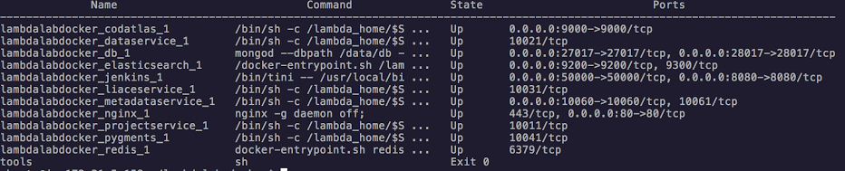
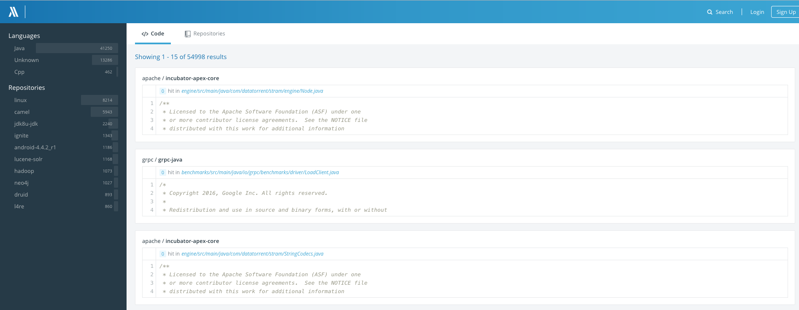

# Download Docker Image and Start Docker Services


Under the root of the git repo(lambdalab-docker), run the following script:

(**In China**) If you are in China, please use `./cn-lambda-compose` instead of `./lambda-compose` in all the following cases)

```bash
./lambda-compose up -d
```

This script will download or upgrade all necessary docker images and start all docker services, it could take a while for the first time. After the script is done, run the following command to verify the services:

```bash
./lambda-compose ps
```

You should see all the docker services lists similar to this:




Open a browser and try to access the public DNS of the server with `http` protocal. For example, if you are using AWS as your cloud service, this address may look like:

```
http://ec2-52-35-135-191.us-west-2.compute.amazonaws.com
``` 

verify that you can see Insight.io home page as showing below:



You are done with the setting up Insight.io if you are not using it with Github Integration. Please refer to [New User Guide](../USER_GUIDE.md) for details on how to use it.