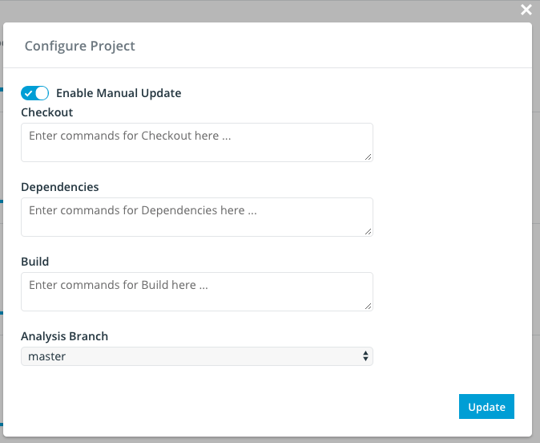

# Configure Manual Update

By default, Insight.io periodically pull updates of all projects from remote. We provide 2 levels of configurations
to disable auto update in **System** and **Project** levels.

## System Level Manual Update

To enable repository manual update for the entire system, add the following configuration to `user.conf`.

```
projectservice.enableManualUpdate: true
```


You need to restart the stack to apply this change. This configuration is honored with higer priority than project level
manual update, i.e., when system level manual update is enabled, even disable the manual update
for a single repository won't work.

## Project Level Manual Update

As mentioned earlier in this doc, you can opt in manual repository update when your first import the project.
If you did not do that, you can also change the setting in the project configuration modal page.



By toggling the switcher on the top and hit `Update` button on the bottom, you can flip the configurations of manual update
for this particular repository.

## Trigger Manual Update

Let's assume you have already, either enabled the manual update for the entire system, or for a specific repository. Then
to trigger an update for a given repository, `GET` `/api/updateProject/<projectId>` will trigger an update for `projectId` repository.

```
GET /api/updateProject/<projectId>
```

Be aware that you have to authenticate before you can successfully call this API, so an API access token is required in the
`X-Auth-Token` header of your request.


**Usage**

```
curl -i --header "X-Auth-Token:<your access token>" <host>/api/updateProject/github.com/apache/hadoop
```