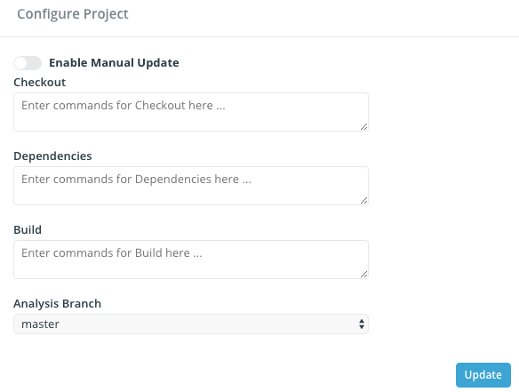

# Customize Repository Build

Insight.io is designed to automatically detect build system used for the repository and run default command such as `mvn package` or `gradle build` to kick off the build steps, which should work well for most of the repositories. However in cases such as when the project need to download some dependencies up-front, or when some custom build steps, Insight.io provides config settings to customize build steps.

To enter the project config page, login with an admin account, go to `$HostName/account/projects`, hover on the project item and click on the config icon, as shown below.

There are 3 sections of the build config, namely Checkout, Dependencies and Build. Checkout section will be triggered after the repository is cloned, this section is designed for tasks such as checkout a sub-repo. Dependencies section will be run before the build steps are run, this section is designed for downloading dependencies that are not covered by the build script, such as C++ dependencies or other library usually installed by using apt-get. Build section is designed for control the build steps to replace common ones such as `mvn package` or `gradle build`
