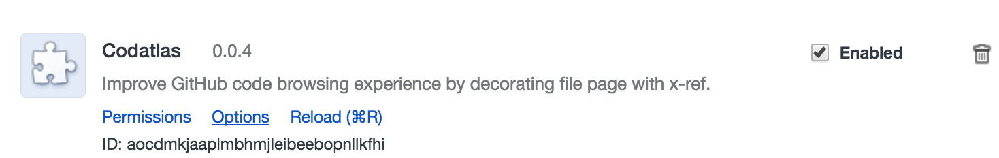
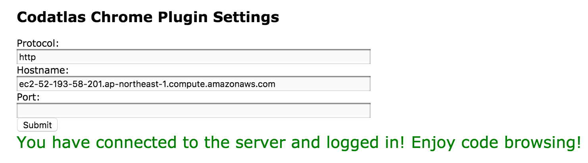

# Use Gitlab Plugin


<!--
### Install and Config Browser Plugin

Codatlas also comes with a Github/Gitlab Chrome plugin allows you to add cross-reference to Github/Gitlab pages.

Before the installation, make sure you can visit  `http://$HostName` and login with Github credential.

To use it, first download Codatlas plugin [here](https://chrome.google.com/webstore/detail/insightio/pmhfgjjhhomfplgmbalncpcohgeijonh)

Codatlas should show up in your extension list, as showing below:



check `Enabled` check box and click on `Options` page, this should bring up an option window for you to put in the server address. put in `$HostName` in `host` box and leave `protocal` to be `http` and `port` to be empty. Click on `Submit` and wait until the following success message to be shown:

```
You have connected to the server and logged in! Enjoy code browsing!
```



If you see some message other success message, here are possible situations:

If you see `Error connecting to server!`, this means that the plugin can not connect to the server. This can be either due to wrong server address or that you have not made exception for SSL connection to the server.

If you see `You have not logged in with Codatlas and will not have access to your private repos`, this means you can connect to Codatlas server but you are not logged in, which will limit your access to private repos.

-->

## Install and Config Native Gitlab Plugin

If you are self-hosting Gitlab, Codatlas also provides a native Gitlab Plugin that could add cross-reference to Gitlab page without the requirement of every user to install a Chrome Plugin. The installation requires
the administrator having direct access to Gitlab deployment.

First, download [content.bundle.js](https://cdn.codatlas.cn/gitlab-plugin/content.bundle.js) and 
[plugin.js](https://cdn.codatlas.cn/gitlab-plugin/plugin.js), and place them under

```bash
$GITLAB_DIR/public/assets/insightio
```

where `$GITLAB_DIR` is your gitlab installation folder. For example for an ubnuntu Omnibus release, the folder path could look like:

```bash
/opt/gitlab/embedded/service/gitlab-rails
```

Then in your `$GITLAB_DIR/app/views/layouts/_head.html.haml`, add following line

```
= javascript_include_tag '/assets/insightio/plugin.js'
```

after

```
= javascript_include_tag "application"
```

Finally, we need to config the plugin to work correctly with your Gitlab and Codatas installation.
Open `$GITLAB_DIR/public/assets/insightio/plugin.js` and make change to the configuration section:

```bash
lambdalabConfig = {
	url: "http://localhost:9000",

	externalUrl: "https://insight.io",

	enablePlugin: true
}
```

`url`: the URL of your on-prem Codatlas instance

`externalUrl`: The fall-back server the plugin will be used to resolve a node that is not found within your on-prem instance. For example the definition of `java.lang.String` may not be found on your on-prem Codatlas instance but will be resolved on insight.io. Set this to empty if you want to disable this feature

`enablePlugin`: Whether you want to enable the plugin by default. When set to false, users have to explicitly attach `enablePlugin=true` query parameter in the URL to enable the plugin. When set to true, the plugin is always enabled for all users. 

You could see a demo deployment [here](http://gitlab-9-0.insight.io/mengwei/pysonar2/blob/master/src/main/java/org/yinwang/pysonar/Analyzer.java).
(For gitlab 8.x) Old Gitlab might have bug in template caching, so you may want to manually clean the cache by:

```
 /opt/gitlab/embedded/bin/redis-cli -s /var/opt/gitlab/redis/redis.socket flushdb
```
notice clean cache will also logout all current user session.

Then you could verify your installation by checking:

- `curl $URL_OF_A_SOURCE_FILE | grep insight.io`
- `curl $GITLAB_URL/assets/insightio/plugin.js`
