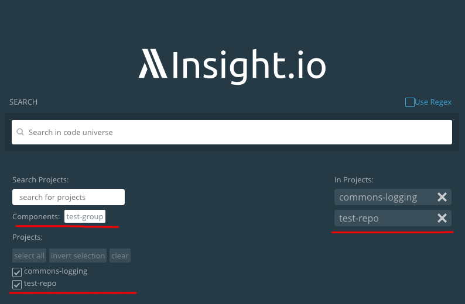

# Configure Repository Components

As the number of repositories in the system grows, you might want to search source code in multiple repositories each time,
maybe for the reason that these repositories are logically tight together.

Now we allow the system admin to group some repositories together and predefine these groups as components.

Curate a `component.json` file (make sure the filename is `component.json` exactly) under `configs/` with a similar structure as follows:

```json
   {
     "componentConfig": [
       {
         "component": "test-group",
         "repos": [
           "github.com/lambdalab/commons-logging",
           "github.com/lambdalab/test-repo"
         ]
       }
     ]
   }
 ```
 
All the components are packed together in the `componentConfig` array. In each element of the array, `component` field
is the name of the component and `repos` is a array of project ids in the system. Make sure project ids are canonical
ids formated as `(origin)/(org)/(project)`, instead if just the project name (e.g. `test-repo` or `commons-logging`).

After the change, restart web server by:

```bash
./lambda-compose restart webserver
```

you should find these components under the search bar in the `/search` page.

