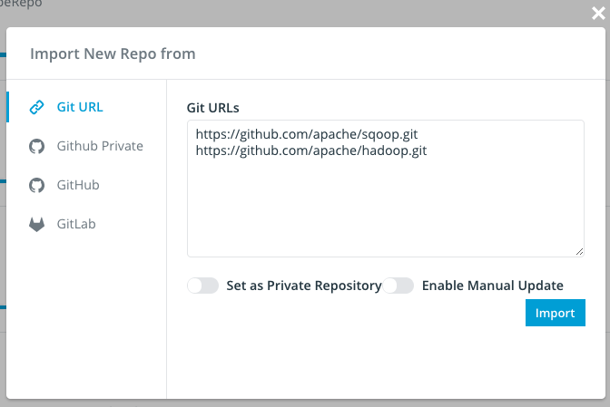

# Import Projects


## Import Projects via Git Urls


### Via UI

To import a batch of project at a time, go to your `Admin Console` and click the `Import New Repo` button
on the top right.

In the popped out modal, you can put multiple git urls into the input box, one url each line.



Notice that there are 2 switchers behind the inputbox, which gives you the options to apply settings to all
the imported projects.

* **Set as Private Repository**: By default, repository on Insight.io are public to all users. However,
with this option opted in, your repository will only be accessible to a limited group of people.


* **Enable Manual Update**: By default, Insight.io periodically pull updates from remote for all the projects, with this
setting enabled, your repository won't be updated automatically. See details in the next section.

### Via API


Instead of import projects in UI, you can also achieve this by using our REST API.

```
POST /api/admin/projects
```

Set `Content-Type` to `application/json` and `POST` with body:

```json
{
  "urls":"https://github.com/apache/sqoop.git\nhttps://github.com/apache/hadoop.git",  // The urls of the repositories you wish to add. Seperate by '\n' for multiple urls.
  "isPrivate":false,  // Set all the repositories to be private repositories or not.
  "enableManualUpdate":false  // Set all the repositories to be updated manually or not.
}
```

Note that this API requires admin priviledge to call.