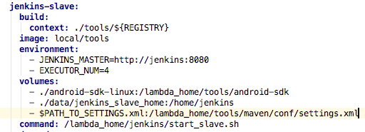

# Change settings.xml for Maven project

Sometimes you may be using your own Maven Central server to either speed up dependency download or host your own jars in your enterprise network, and usually this custom Maven Central server address is specified in settings.xml file. 

In order to make user-specified settings.xml visible to Codatlas's docker container, you need to mount the file into the container. To do that, open docker-compose.yml (or cn-docker-compose.yml if you use cn-lambda-compose to start the stack) with a text editor, and add the following line under `services:tools:volumes` section:

`$PATH_TO_SETTINGS.xml:/lambda_home/tools/maven/conf/settings.xml`

where `$PATH_TO_SETTINGS.xml` is the absolute path to the settings.xml you want Codatlas to use. 



After the change is applied, refresh docker stack by:

```bash
./lambda-compose up -d
```